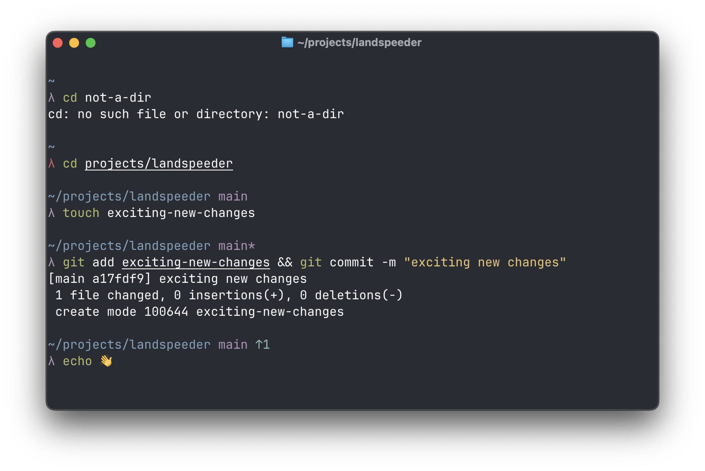

<div align="center">
  <h1>💨 landspeeder 💨</h1>
  <p>More of an X-34 than an XP-38, but it should be enough</p>
  
</div>

## A not at all clever or customisable shell prompt.

- Not at all customisable (yet).

- Supports Zsh and macOS (so far).

## How to use it:

Build it:
```
zig build
```

Add this to your `.zshrc`:
```
precmd() {
    export LAST_CMD_STATUS=$?
    PROMPT="$(~/repos/landspeeder/zig-out/bin/landspeeder)"
}
```

## TODO

- [x] Display basic prompt
- [x] Indicate last command status 
- [x] Display working directory
- [x] Display git branch
- [x] Display git unpushed/unpulled 
- [] Display project language
- [] Display last command execution time
- [] Truncate long paths
- [] Use terminal colour theme
- [] Indicate when in Vi mode
- [] Display username and host when in ssh or container
